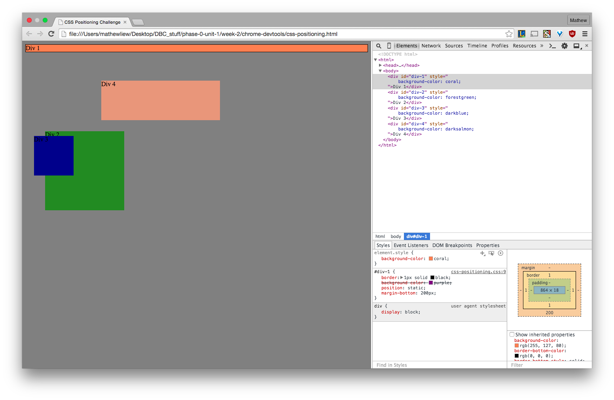
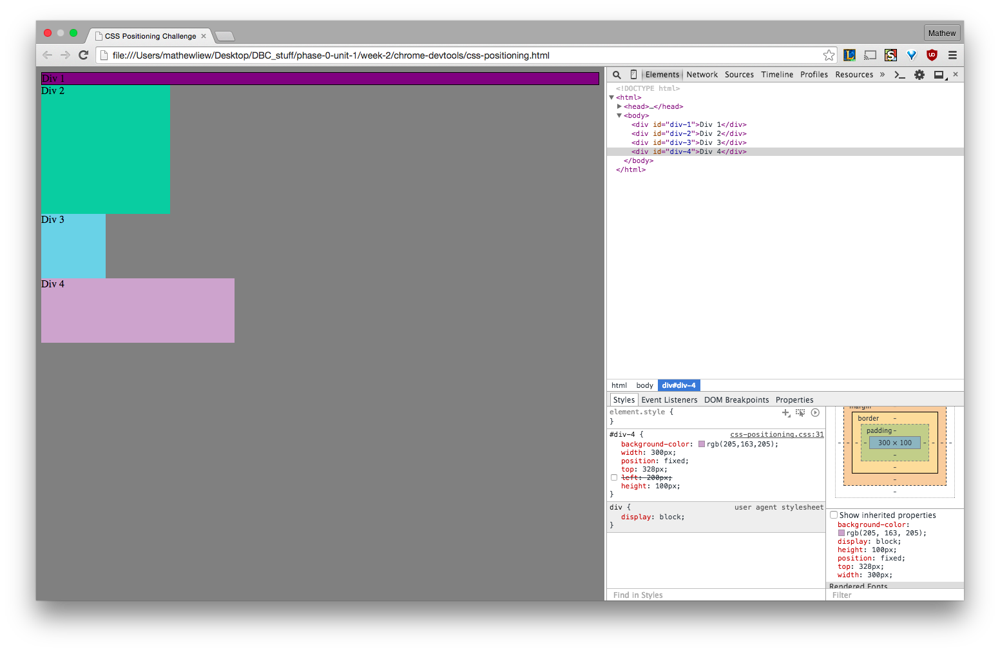
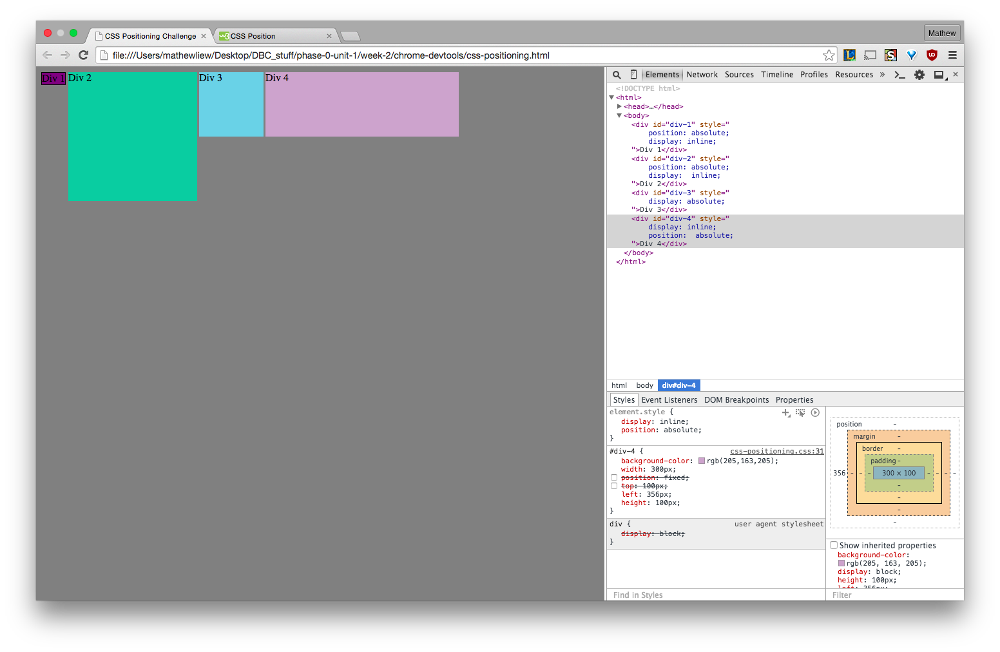
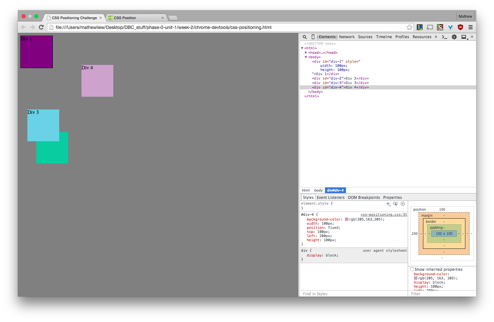
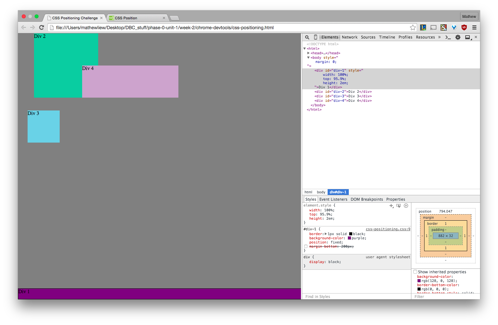
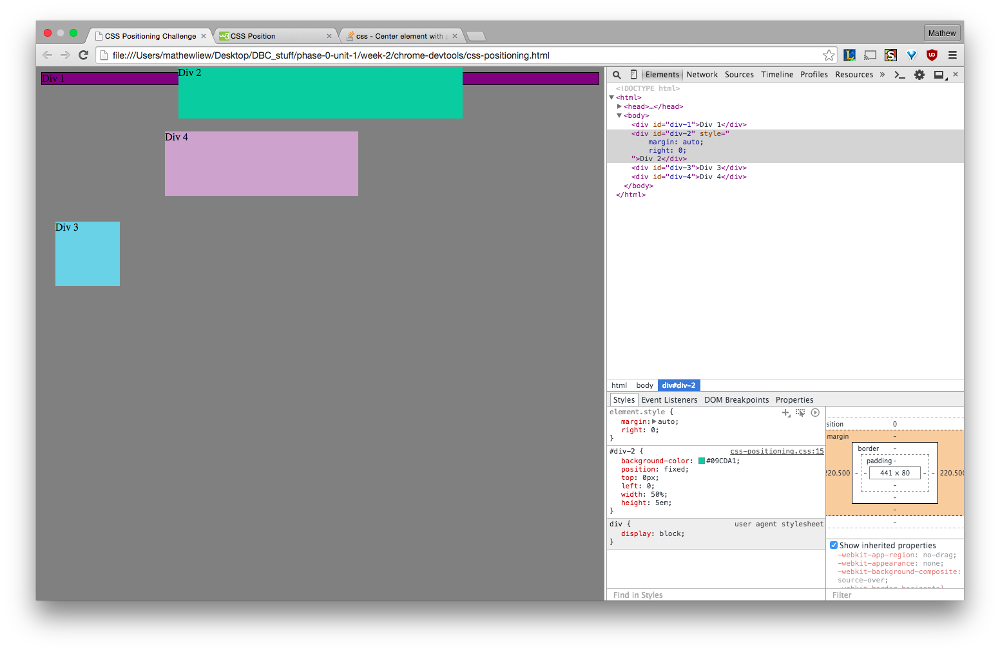
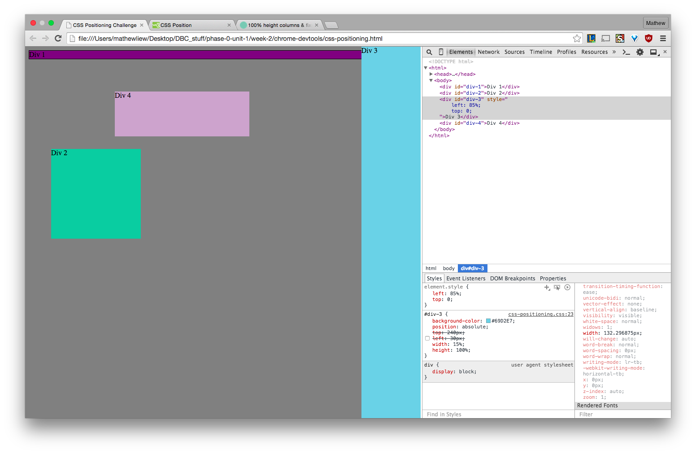
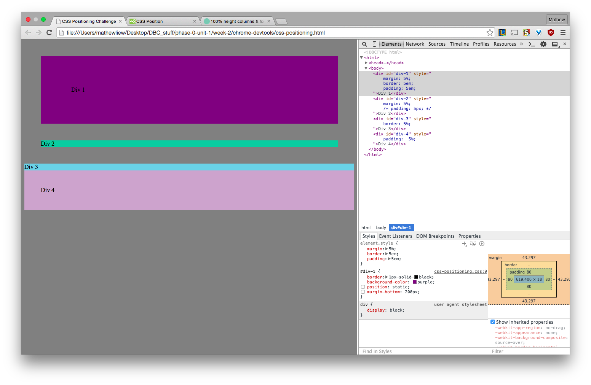

# 7. Chrome Dev Tools Challenge Reflection

#### I spent 1.5 hours on this challenge.

## Release 2: Positioning

#### 1. Change the Colors

#### 2. Column

#### 3. Row

#### 4. Make Equidistant

#### 5. Squares

#### 6. Footer

#### 7. Header

#### 8. Sidebar

#### 9. Get Creative

## Release 3: Reflection
Use the [reflection guidelines](https://github.com/Devbootcamp/phase-0-handbook/blob/master/coding-references/reflection-guidelines.md) to help frame your reflection.

This challenge was mildly difficult. The position and display attributes and how they interact was the most challenging. Trial and error was truely the best way to figure them out though. I used google to fill in gaps I wasn't sure about. I feel pretty confident about the DOM now, though I'm still shaky with positioning such as relative and static.

