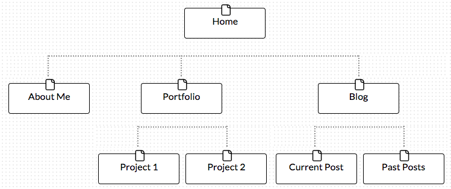

## 2. Site Planning Reflection

#### I spent 1.5 hours on this challenge.

### Site planning

1. What is your site's primary goal or purpose?
The site will show my skills as a Developer when looking for jobs.
2. What kind of content will your site feature?
The site will list projects I have completed as well as a blog to display my progress and current ideas I'm working on.
3. What is the best way to share that content with users?
I will visually show the project with links for more detailed descriptions of them. It will also link to Github to show the code.
4. Think about your target audience. What are their interests and how do you see your site addressing them?
Target audience would be companies/recruiters looking for a Junior developer. By displaying what I can do, this will hopefully hook them.
5. How do you think most users will find your site?
I will use social media and hopefully SEO to advertise my site.
6. What is the primary "action" the user should take when coming to your site? Do you want them to search for information, contact you, or see your portfolio? It's ok to have several actions at once, or different actions for different kinds of visitors.
The user would ideally click through my portfolio and learn a little about me.

***

### Site map

Your site map:

- What did you learn about design and user experience?
- Do you like design and user experience? Was it fun planning your site and creating a site map? (If you hated it, that's OK too)
- What questions did you ask during this challenge? What resources did you find to help you answer them?
- What concepts are you having trouble with, or did you just figure something out? If so, what?
- How confident are you with each of the Learning Competencies for this challenge?
- Which parts of the challenge did you enjoy?
- Which parts of the challenge did you find tedious?

It's important to incorporate design and user experience early into the development process. I liked designing the site because it was good to have direction before going to far into coding. I had to double check markdown language since it has been a while since I've looked at the syntax. I used the internet for this. I'm feeling pretty good about understanding the user experience and working through the 6 stages of development. I enjoyed the mapping portion since I'm a visual person. Being able to see everything in front of me was helpful. With my background in user experience, I don't find this tedious but rather have it go more in detail.

