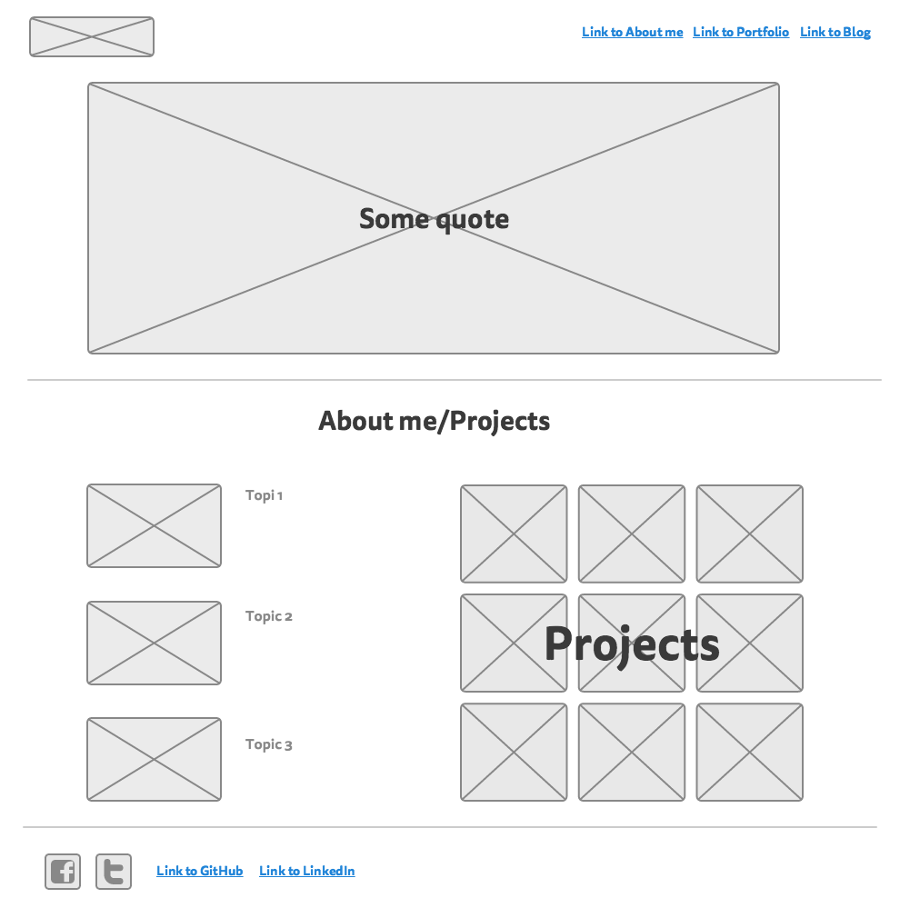
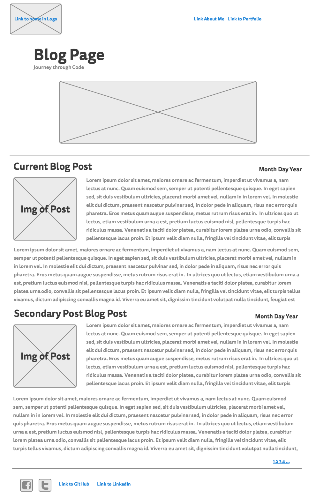
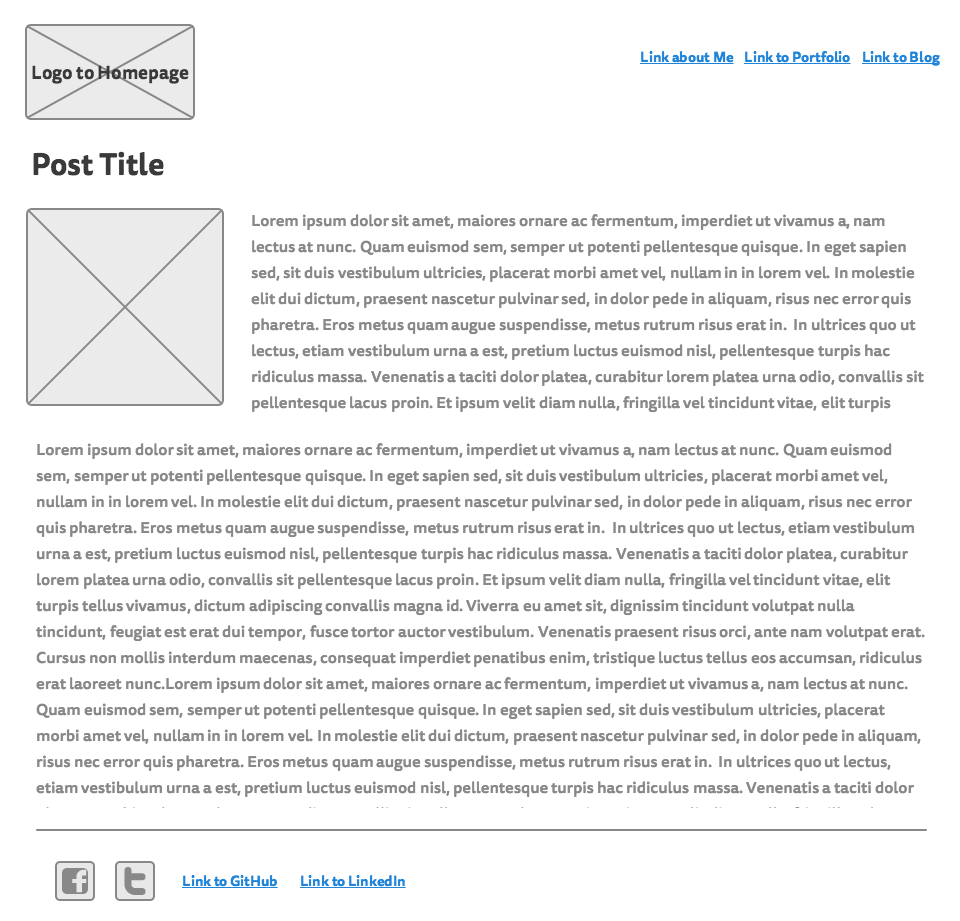

## 3. Wireframing Reflection

#### I spent 1 hour on this challenge.

*Remember, reflections should only take about 10-15 minutes.*

Include images of your wireframe (inline, using markdown) below:

Index Wireframe: 

Blog Template Wireframe: 

Blog Post Wireframe: 

***

- Did you enjoy wireframing your site?
- Did you find yourself revising your wireframe often? Or did you stick with your first idea?
- What questions did you ask during this challenge? What resources did you find to help you answer them?
- What concepts are you having trouble with?
- Did you learn any new skills or tricks?
- How confident are you with each of the Learning Competencies for this challenge?
- Which parts of the challenge did you enjoy?
- Which parts of the challenge did you find tedious?

Wireframing was fun. I enjoyed adjusting the webpage visually. I kept revising my wireframe after I saw my inital layout. I wondered how other people used wireframe so I googled sample wireframes. I'm still not sure which is the best wireframe tool, but I'll have to try out more. Each wireframe tool is definitely it's own getting used to. I feel strong about basic wireframing from this lesson. I used Mockingbird, but specifically not being able to copy and paste between the pages was annoying.

